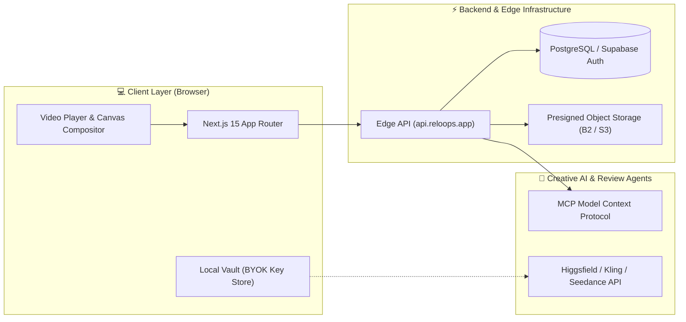

<div align="center">

  

  # Reloops
  ### The Modern Open-Source Creative Review & AI Video Collaboration Platform

  [](https://github.com/Reloops-App/Reloops/stargazers)
  [](https://opensource.org/licenses/MIT)
  [](https://nextjs.org/)
  [](https://www.typescriptlang.org/)
  [](https://discord.gg/reloops)

  <p align="center">
    <b>Reloops</b> is an open-source, high-performance creative asset review, frame-accurate video markup, and AI video synthesis platform built for creative studios, video editors, and agency teams.
  </p>

  <p align="center">
    <a href="https://reloops.app"><strong>Explore Website »</strong></a>
    ·
    <a href="#-quick-start"><strong>Quick Start</strong></a>
    ·
    <a href="#-developer-api--mcp-usage"><strong>API Docs</strong></a>
    ·
    <a href="https://github.com/Reloops-App/Reloops/issues"><strong>Report Issue</strong></a>
  </p>

</div>

---

## ⚡ Visual Highlights & Studio Capabilities

<table>
  <tr>
    <td width="50%">
      <h3 align="center">🎯 Frame-Accurate Video Review</h3>
      <p align="center">Pinpoint visual feedback directly on 4K frames with SMPTE timecode rulers, bounding boxes, arrows, and threaded comment chains.</p>
      
    </td>
    <td width="50%">
      <h3 align="center">🔄 Stacked Version Control & Diffing</h3>
      <p align="center">Compare iterations side-by-side with interactive split-sliders. Maintain full revision lineage from <code>v1</code> rough cuts to final approval.</p>
      
    </td>
  </tr>
  <tr>
    <td width="50%">
      <h3 align="center">🤖 Multi-Asset AI Video Studio</h3>
      <p align="center">Transform sequence keyframes (<code>1.png</code> ➔ <code>2.png</code> ➔ <code>3.png</code>) into continuous photorealistic flythrough videos with camera trajectory physics.</p>
      
    </td>
    <td width="50%">
      <h3 align="center">🔒 Frictionless Client Share Portals</h3>
      <p align="center">Deliver password-protected, branded review rooms for external clients to approve cuts with zero sign-up friction.</p>
      
    </td>
  </tr>
</table>

---

## 🚀 Key Features

- **⏱️ 60fps Frame-Accurate Scrubbing**: Ultra-smooth playback engine with SMPTE timecode overlay and real-time thumbnail filmstrip.
- **🎨 On-Screen Annotation Toolkit**: Draw arrows, highlight regions with bounding boxes, sketch freehand, and pin comments directly to video frames.
- **📚 Workspace & Folder Hierarchy**: Granular multi-tenant asset organization with assigned review pickup queues (`needs_review`, `in_review`, `approved`).
- **🔑 Bring Your Own Key (BYOK) Security**: Zero server-side key storage. AI provider keys (Higgsfield, Kling, Seedance) are securely isolated in the browser's local storage.
- **⚡ Direct Presigned Cloud Ingestion**: High-speed chunked uploads (up to 5GB) straight to Backblaze B2 / Amazon S3 storage buckets.
- **🤖 Developer API & MCP Integration**: Programmatically trigger reviews, query queues, or stack new revision assets via Antigravity, Claude, and n8n.

---

## 🛠️ Tech Stack & System Architecture



---

## 🏁 Quick Start

### Prerequisites
- Node.js `18.18+` or `20+`
- npm, pnpm, or yarn

### 1. Clone the repository
```bash
git clone https://github.com/Reloops-App/Reloops.git
cd Reloops
```

### 2. Install dependencies
```bash
npm install
```

### 3. Setup environment configuration
```bash
cp .env.example .env.local
```

### 4. Start the development server
```bash
npm run dev
```

Open [http://localhost:3000](http://localhost:3000) in your browser to launch the studio.

---

## 🔌 Developer API & MCP Usage

Reloops provides a comprehensive REST API for automated reviews and generative video pipelines:

```typescript
import { ReloopsClient } from '@reloops/sdk';

const reloops = new ReloopsClient({
  apiKey: process.env.RELOOPS_API_KEY
});

// 1. Fetch pending review queue
const pendingReviews = await reloops.reviews.listRequested();

// 2. Stack a new iteration to an existing version chain
const newVersion = await reloops.assets.uploadVersion({
  parentAssetId: 'ast_9843a81f',
  file: finalColorGradeBuffer,
  status: 'needs_review',
  comment: 'Version 2 with bridge archway push-in trajectory applied.'
});

console.log(`Uploaded revision stack: ${newVersion.versionNumber}`);
```

---

## 🤝 Contributing

We welcome contributions from video editors, developers, and creative AI enthusiasts! Please see our [CONTRIBUTING.md](./CONTRIBUTING.md) for full setup and PR guidelines.

---

## 📜 License

Reloops is open-source software licensed under the **MIT License**. See the [LICENSE](./LICENSE) file for details.
