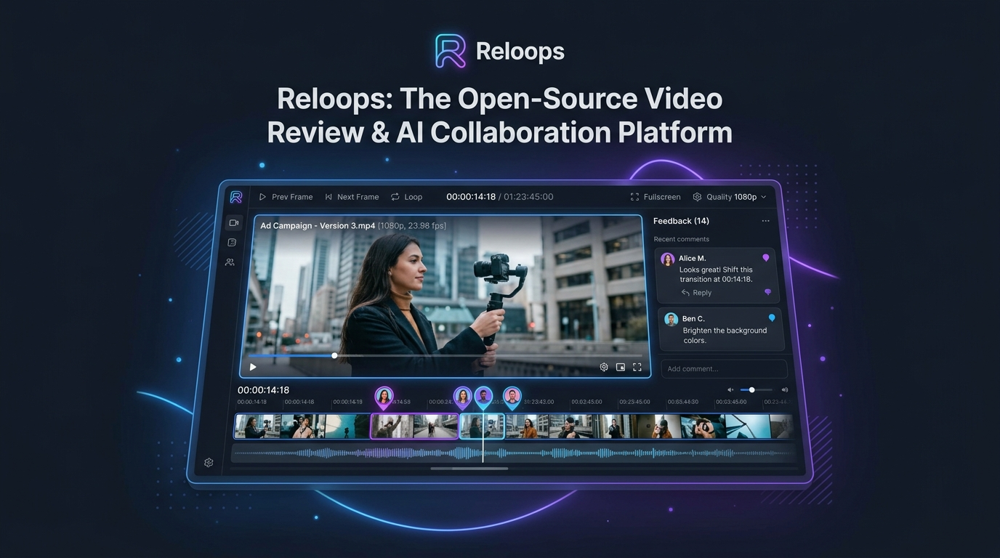
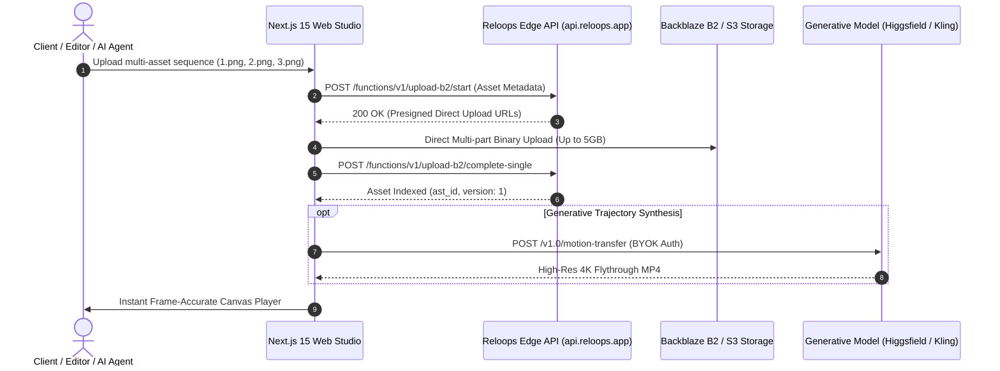
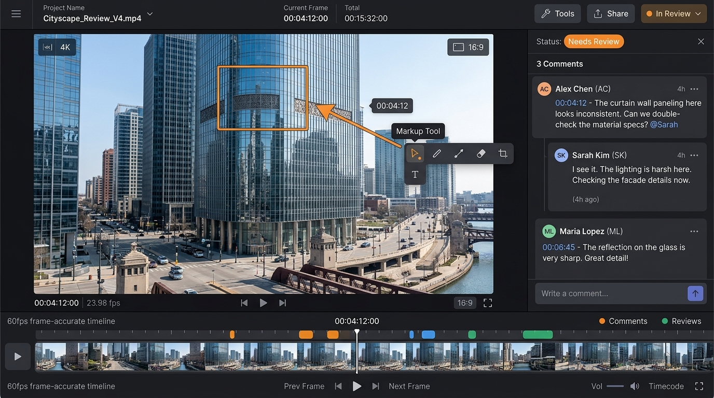
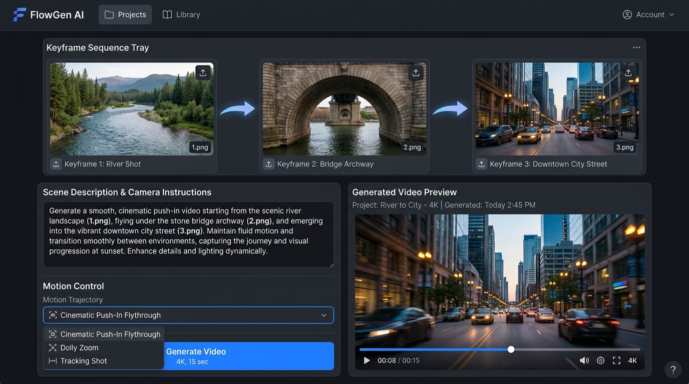
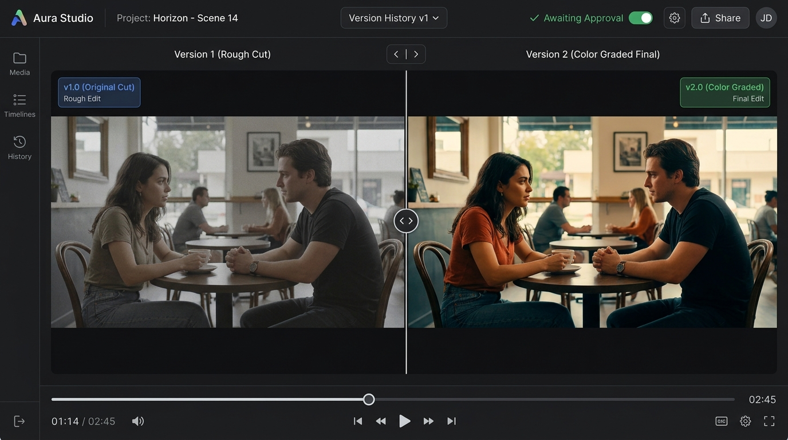
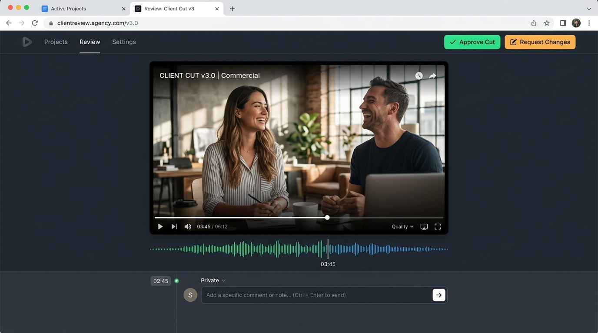

<div align="center">

  

  # Reloops Engine
  ### Developer-First Creative Asset Review, S3/B2 Storage & AI Video Agent Infrastructure

  [](https://github.com/Reloops-App/Reloops/stargazers)
  [](https://opensource.org/licenses/MIT)
  [](https://api.reloops.app)
  [](https://github.com/Reloops-App/Reloops)
  [](https://reloops.app)

  <p align="center">
    <b>Reloops Engine</b> provides developers, AI engineers, and automation teams with a programmable asset review API, high-speed presigned media ingestion, and agentic video synthesis infrastructure.
  </p>

  <p align="center">
    <a href="#-system-architecture"><strong>Architecture</strong></a>
    ·
    <a href="#-sdk--api-integration"><strong>SDK Reference</strong></a>
    ·
    <a href="#-ai-agent-mcp-integration"><strong>MCP Setup</strong></a>
    ·
    <a href="#-self-hosting--deployment"><strong>Deploy</strong></a>
  </p>

</div>

---

## 🏗️ System Architecture

Reloops decouples the heavy media ingestion pipeline from the application layer using client-side presigned S3/Backblaze B2 URLs, Edge functions, and browser-isolated BYOK key vaults.



---

## ⚡ Key Architectural Principles

1. **Zero Intermediate Proxying**: Video files (up to 5GB) upload straight from the browser to cloud buckets via presigned multi-part URLs.
2. **Bring-Your-Own-Key (BYOK) Security**: AI provider keys are stored exclusively in client `localStorage` and dispatched with request headers—never persisted to the server database.
3. **Model Context Protocol (MCP) Compatible**: Native support for Anthropic Claude, Google Antigravity, and n8n workflows to manage review queues autonomously.
4. **Frame-Accurate Video Metadata Engine**: Microsecond-precision timecode indexing for comments, annotations, and split-screen comparison diffs.

---

## 📸 Platform Interface

<table>
  <tr>
    <td width="50%">
      <b>Video Review & Annotation Engine</b>
      
    </td>
    <td width="50%">
      <b>Multi-Asset AI Trajectory Studio</b>
      
    </td>
  </tr>
  <tr>
    <td width="50%">
      <b>Version Comparison Slider</b>
      
    </td>
    <td width="50%">
      <b>Client Share & Approval Portal</b>
      
    </td>
  </tr>
</table>

---

## 💻 SDK & API Integration

### 1. Installation
```bash
npm install @reloops/sdk
```

### 2. Programmatic Review & Version Stacking
```typescript
import { ReloopsClient } from '@reloops/sdk';

const reloops = new ReloopsClient({
  apiKey: process.env.RELOOPS_API_KEY,
  endpoint: 'https://api.reloops.app/functions/v1'
});

async function processReviewQueue() {
  // 1. Fetch unassigned items requiring review
  const queue = await reloops.assignedItems.list({ status: 'needs_review' });

  for (const item of queue) {
    console.log(`Processing review item: ${item.assetName} [${item.id}]`);

    // 2. Add timecode comment
    await reloops.comments.create({
      assetId: item.id,
      timestampSeconds: 4.20,
      content: 'Edge blur detected at 00:04:12. Applying trajectory sharpen pass.'
    });

    // 3. Upload new iteration to the version stack
    await reloops.assets.stackRevision({
      parentAssetId: item.id,
      filePath: './exports/v2_sharpened.mp4',
      status: 'approved'
    });
  }
}

processReviewQueue();
```

---

## 🤖 AI Agent MCP Integration (Antigravity & Claude)

Add the Reloops MCP server configuration to your agent setup (`mcp_config.json`):

```json
{
  "mcpServers": {
    "reloops": {
      "command": "npx",
      "args": ["-y", "@reloops/mcp-server"],
      "env": {
        "RELOOPS_API_KEY": "reloops_live_your_key_here"
      }
    }
  }
}
```

---

## 🚀 Self-Hosting & Deployment

### Quick Docker Deployment
```bash
git clone https://github.com/Reloops-App/Reloops.git
cd Reloops
docker compose up -d
```

---

## 📜 License

Reloops is open-source software licensed under the **MIT License**.
